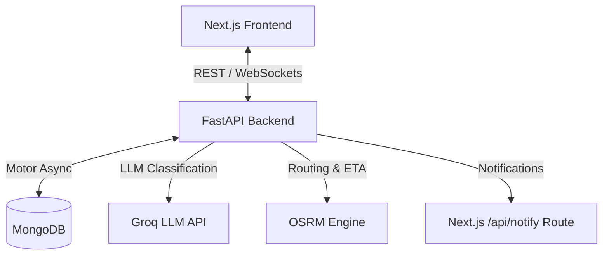

# SwarmRescue AI - System Architecture

## System Overview

SwarmRescue AI coordinates disaster rescue efforts using real-time spatial positioning, LLM-based emergency report classification, dynamic scoring engines, and multi-tier response units (Teams, Ambulances, Hospitals, Volunteers).

## Core Architecture Components

### Components

1. **Frontend (Next.js 15, App Router)**
   - Citizen emergency report intake (`(public)/report`)
   - Dispatcher control dashboard & interactive map (`(dashboard)/admin`)
   - Responder task interface (`(dashboard)/team`)
   - Analytics & response time statistics (`(dashboard)/analytics`)

2. **Backend (FastAPI, Python 3.11+)**
   - Motor async MongoDB access with 2dsphere geospatial indexing
   - Groq-powered severity classification
   - Multi-criteria weighted scoring engine for task assignment
   - OSRM route computation
   - Real-time WebSockets dispatch broadcast manager
